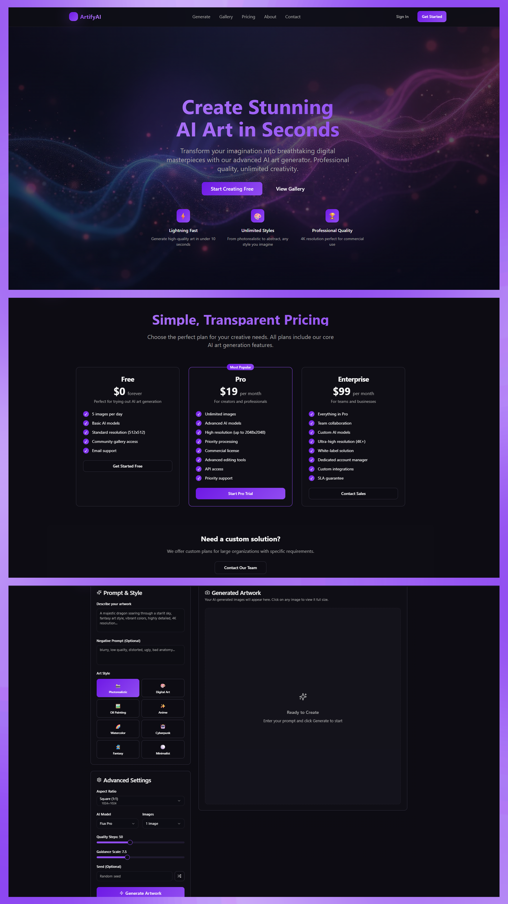

# 🎨 AI Art Studio

A professional AI-powered art generation platform built with modern web technologies. Create stunning artwork using advanced AI models with comprehensive customization options.


<!-- Portfolio preview image: place your screenshot at `public/artify-gallery-portfolio.png` -->

## ✨ Features

### 🎯 Core Functionality
- **AI Art Generation**: Create unique artwork using state-of-the-art AI models
- **Style Presets**: Choose from various artistic styles (Realistic, Digital Art, Oil Painting, etc.)
- **Advanced Controls**: Fine-tune generation with aspect ratios, resolution, steps, and guidance scale
- **Negative Prompts**: Exclude unwanted elements from your artwork
- **Batch Generation**: Create multiple variations simultaneously

### 🖼️ Gallery & Management
- **Personal Gallery**: View and manage your created artwork
- **Generation History**: Track your creative journey
- **Download & Share**: Export high-quality images and share your creations
- **Responsive Grid**: Beautiful gallery layout that works on all devices

### 📱 User Experience
- **Modern UI/UX**: Clean, professional interface built with shadcn/ui
- **Responsive Design**: Seamless experience across desktop, tablet, and mobile
- **Dark/Light Mode**: Adaptive theming for user preference
- **Smooth Navigation**: Client-side routing with React Router

### 🏢 Professional Pages
- **Landing Page**: Engaging hero section with features and testimonials
- **Generate**: Comprehensive art creation studio
- **Gallery**: Showcase of generated artwork
- **Pricing**: Subscription tiers and features
- **About**: Mission and technology overview
- **Contact**: Professional contact form

## 🛠️ Technology Stack

### Frontend
- **React 18** - Modern React with hooks and functional components
- **TypeScript** - Type-safe development
- **Vite** - Lightning-fast build tool and development server
- **React Router DOM** - Client-side routing and navigation

### Styling & UI
- **Tailwind CSS** - Utility-first CSS framework
- **shadcn/ui** - Modern, accessible component library
- **CSS Custom Properties** - Semantic design tokens
- **Responsive Design** - Mobile-first approach

### State Management & Forms
- **React Hook Form** - Performant form handling
- **Zod** - Schema validation
- **React Query** - Server state management

### Development Tools
- **ESLint** - Code linting and best practices
- **PostCSS** - CSS processing
- **Lucide Icons** - Beautiful, consistent icons

## 🚀 Quick Start

### Prerequisites
- Node.js 18+ 
- npm or yarn

### Installation

```bash
# Clone the repository
git clone <your-repo-url>
cd ai-art-studio

# Install dependencies
npm install

# Start development server
npm run dev
```

### Build for Production

```bash
# Build the application
npm run build

# Preview production build
npm run preview
```

## 📖 Usage

### Generating Art

1. **Navigate to Generate page**
2. **Enter your prompt** - Describe the artwork you want to create
3. **Select style preset** - Choose from available artistic styles
4. **Configure settings**:
   - Aspect ratio (Square, Portrait, Landscape, etc.)
   - Resolution (512x512 up to 1024x1024)
   - Steps (10-50 for quality vs speed)
   - Guidance scale (1-20 for prompt adherence)
5. **Add negative prompts** (optional) - Exclude unwanted elements
6. **Generate** - Create single or multiple variations

### Managing Your Gallery

- **View creations** in the Gallery page
- **Download** high-resolution images
- **Share** your artwork with others
- **Delete** unwanted generations

## 🎨 Design System

The project uses a comprehensive design system with:

- **Semantic color tokens** - HSL-based color system
- **Typography scale** - Consistent font sizes and weights  
- **Spacing system** - Harmonious layout spacing
- **Component variants** - Flexible UI components
- **Dark mode support** - Automatic theme switching

## 📁 Project Structure

```
src/
├── components/          # Reusable UI components
│   ├── ui/             # shadcn/ui components
│   ├── ArtGenerator.tsx # Main generation interface
│   ├── Gallery.tsx     # Image gallery component
│   ├── Navigation.tsx  # Site navigation
│   └── ...
├── pages/              # Route components
│   ├── Index.tsx       # Homepage
│   ├── Generate.tsx    # Art generation page
│   ├── GalleryPage.tsx # Gallery page
│   └── ...
├── hooks/              # Custom React hooks
├── lib/                # Utility functions
├── assets/             # Static assets
└── main.tsx           # Application entry point
```

## 🌟 Key Features Implementation

### Advanced Art Generator
- Professional studio interface with comprehensive controls
- Real-time preview and settings adjustment
- Batch generation with progress tracking
- History management and organization

### Responsive Design
- Mobile-first approach with Tailwind CSS
- Flexible grid layouts
- Touch-friendly interfaces
- Optimized for all screen sizes

### Modern React Patterns
- Functional components with hooks
- Custom hooks for reusable logic
- Proper TypeScript integration
- Performance optimizations

## 🔧 Customization

### Adding New Styles
```typescript
// Add to style presets in ArtGenerator.tsx
const stylePresets = [
  // ... existing styles
  { name: "Your Style", prompt: "your style prompt" }
]
```

### Modifying Theme
```css
/* Update design tokens in src/index.css */
:root {
  --primary: your-hsl-values;
  --secondary: your-hsl-values;
  /* ... other tokens */
}
```

## 🚀 Deployment


### Vercel/Netlify
```bash
# Build for static hosting
npm run build

# Deploy dist/ folder to your hosting provider
```

## 🤝 Contributing

1. Fork the repository
2. Create a feature branch (`git checkout -b feature/amazing-feature`)
3. Commit changes (`git commit -m 'Add amazing feature'`)
4. Push to branch (`git push origin feature/amazing-feature`)
5. Open a Pull Request

<!-- ## 📝 License

This project is licensed under the MIT License - see the [LICENSE](LICENSE) file for details. -->

## 🙏 Acknowledgments

- **shadcn/ui** - For the beautiful component library
- **Lucide** - For the consistent icon set
- **Tailwind CSS** - For the powerful styling framework

## 📞 Contact

For questions, suggestions, or collaboration opportunities, please reach out through the Contact page or open an issue on GitHub.

---

**Built with ❤️ using React, TypeScript, and modern web technologies**
